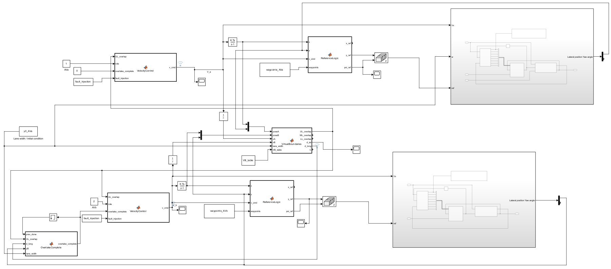
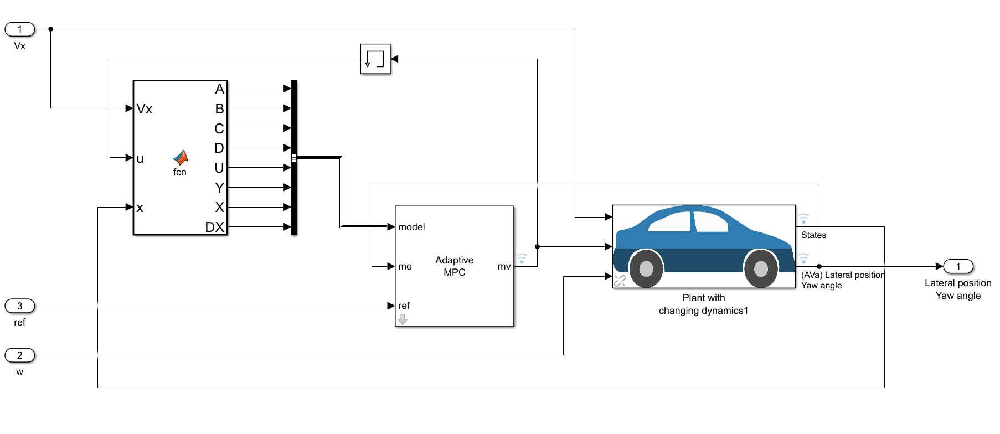
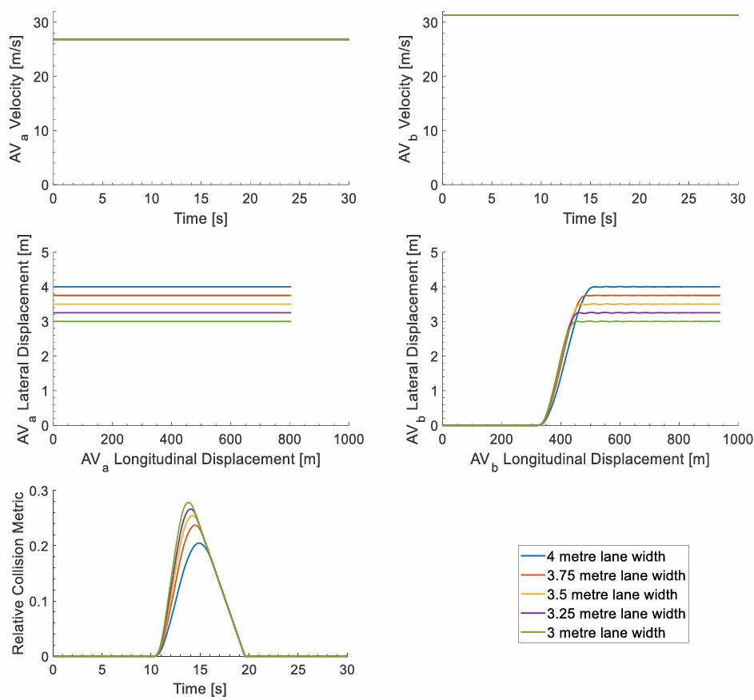
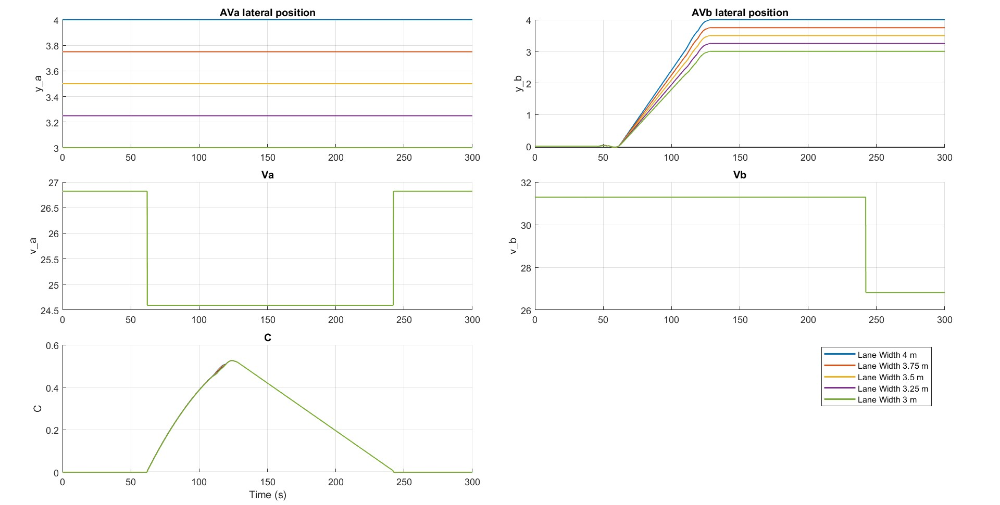
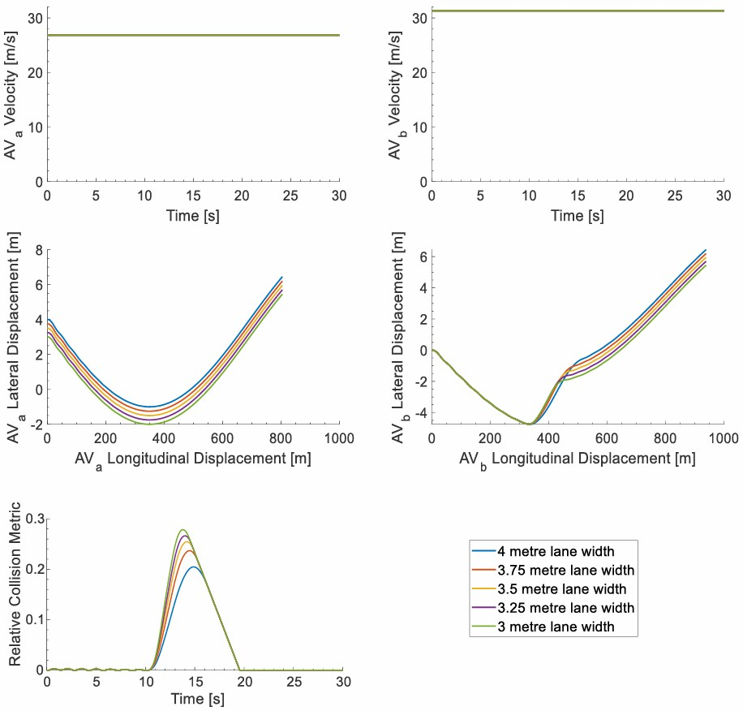
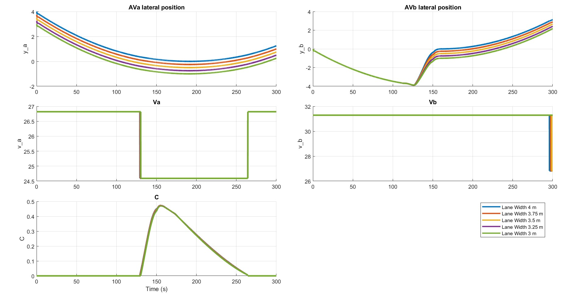

# CAS 781 — Autonomous Overtaking with Reduced Lane Widths (MATLAB/Simulink + Report)

This repository contains my **CAS 781** project on the safety of an **autonomous highway overtaking** maneuver (AVa/AVb) under **reduced lane widths**.  
The main purpose of the repo is to **document the project** and encourage the reader to consult the **full write-up** (PDF), which includes:

- **Part I:** reproduction and verification of the paper’s collision metric and published figures (straight + curved cases),
- **Part II:** an STPA analysis and a simulation-based fault/unsafe control action injection.

> ✅ This README focuses on **Part I** and embeds **simulation figures only** (no STPA figures).

---

## Documents included in this repository

- **Project Proposal (PDF):** `CAS781_Project_Proposal.pdf`  
  Initial objectives, planned methodology, and project scope.

- **Final Report (PDF):** `CAS781_Final_Report_Herri_Tahar.pdf`  
  Full technical details, analytic checks, paper-vs-reproduction comparisons (straight and curved), and the STPA + fault-injection section.

If you only read one document, read the **Final Report**. This README is only a quick entry point.

---
## Repository structure

```text
.
├── Docs/          # Project proposal and final report (PDF)
├── Project_root/  # MATLAB / Simulink project
├── figures/       # Figures used in the report and README
├── README.md
```

---

## Project summary

Two autonomous vehicles travel on a two-lane highway:

- **AVa:** lead vehicle  
- **AVb:** overtaking vehicle

The same scenarios are run for multiple lane widths:

- \( $w \in \{4.0,\; 3.75,\; 3.5,\; 3.25,\; 3.0\}\,\mathrm{m}$ \)

Safety is evaluated using:

- **Virtual Boundaries (VBs)** (longitudinal + lateral),
- a **collision metric** \(C(t)\) defined in the reference paper.

---

## Part I — Reproducing the collision metric \(C(t)\)

### What is being tested (and why it matters)

The paper defines the lateral “side VBs” for each lane as:

- \($S_{nl} = S_{nr} = w/2$\)

Under the additional modeling assumption that both vehicles track the **lane centers** (lane-centre tracking), the report shows analytically that the **lane width \(w\)** cancels out in the **lateral term** of \(C(t)\).  

So, **within that specific interpretation of the paper** (side VBs proportional to lane width + lane-centre trajectories), the collision metric is expected to exhibit **little to no lane-width dependence**—especially in the straight-highway setup.

This analytical expectation is then checked against Simulink simulations.

---

## Running the simulations (quick start)

From the project root folder in MATLAB, run:

```matlab
RUNME_CAS781_Project
```

This script is the project’s automated entry point. It:

- sets up MATLAB paths,
- initializes required workspace variables,
- runs **all scenarios sequentially** (straight + curved road section, for all lane widths),
- generates the figures used in the report.

---

## Simulink model (single architecture for all scenarios)

A single Simulink architecture is used for:

- the **straight highway** scenario,
- the **curved road section** scenario (with curved references/waypoints).



---

## Straight highway — paper vs reproduction

### Paper figure (reference)

The paper reports a clear increase in the peak of \(C(t)\) as the lane width decreases.



### Simulink reproduction (this project)

Using the paper’s written definitions (notably \(S_{nl}=S_{nr}=w/2\)) and implementing the stated rule-based speed behavior, the reproduced straight-road results can be compared against the analytical expectation described above.



**How to interpret this figure (context)**

- The top plots show lane-dependent lateral motion (lane centers shift with \(w\), so trajectories scale accordingly).
- The bottom plot shows the resulting \(C(t)\) curves across lane widths.
- The report explains how this simulated behavior aligns (or not) with the expected cancellation of \(w\) under the stated assumptions, and contrasts it with the paper’s reported trend.

---

## Curved road section — paper vs reproduction

### Paper figure (reference)

The paper also reports an increasing peak \(C_{\max}\) as lane width decreases in the curved case.



### Simulink curved road section (this project)

The curved road section is simulated using the same Simulink model, but with curved reference trajectories/waypoints.



**How to interpret this figure (context)**

- This result is provided to mirror the paper’s curved scenario structure.
- The report discusses how the reproduced curved-road behavior compares to the paper’s qualitative trend, and which modeling assumptions dominate the outcome.

---

## Part I takeaway (high-level)

Under the specific assumptions used for the reproduction (as described in the report)—particularly **side VBs set to \(w/2\)** and **lane-centre tracking**—the report argues that strong lane-width dependence of \(C(t)\) is not expected mathematically, and it examines whether the simulated results support that expectation.

For the full reasoning and the detailed comparison with the paper’s figures, see:  
- `CAS781_Final_Report_Herri_Tahar.pdf`

---

## Author

**Tahar Herri** — McMaster University (CAS 781) & Grenoble INP ESISAR

---

## Reference paper

- J. D’Souza, K. J. Burnham, and J. E. Pickering, *An Investigation into the Safety of Autonomous Vehicles on Highways with Reduced Lane Widths*, Proceedings of the 10th International Conference on Control, Decision and Information Technologies (CoDIT), 2024. DOI: `10.1109/CoDIT62066.2024.10708388`
---